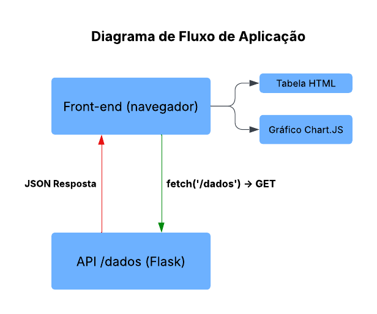

# Teste Técnico - Grupo Jacto

Aplicação desenvolvida para o **Desafio Técnico – Estágio em Desenvolvimento** do Grupo Jacto.  
O objetivo é criar uma aplicação web simples que simula a visualização de dados do agronegócio brasileiro, com comunicação entre **backend (API)** e **frontend (visualização em tabela e gráfico)**.  

<br>

 ## Demonstração em Vídeo

[(Clique aqui para assistir ao vídeo)](https://drive.google.com/file/d/1bfqrG7s8Pdw5bapG3kKa_-Tb36oxRSMm/view?usp=sharing) 
<br>
_OBS: Vídeo está acelerado para 1.2x devido o tamanho_

<br>

## Requisitos da Aplicação

Segundo o enunciado do teste, a aplicação deveria atender aos seguintes pontos:

- **Backend**
  - Desenvolvido em Python (Flask/FastAPI).  
  - Expor uma API REST com a rota `/dados`.  
  - Retornar lista de objetos JSON simulando dados agrícolas, por exemplo:
    ```json
    [
      {"estado": "SP", "produto": "Soja", "quantidade": 1000},
      {"estado": "PR", "produto": "Milho", "quantidade": 800}
    ]
    ```

- **Frontend**
  - Desenvolvido em HTML + JavaScript puro.  
  - Consumir a API `/dados`.  
  - Exibir os dados em uma **tabela**.  
  - Exibir um **gráfico de barras** com a quantidade por estado.

<br>

## Diagrama de Fluxo

O diagrama de fluxo foi criado para guiar a lógica de comunicação entre backend e frontend, assegurando clareza no processo de desenvolvimento.



<br>

## Dados Utilizados

Para tornar a aplicação mais próxima de um cenário real, utilizei dados do **IBGE – Produção Agrícola Municipal (PAM)**, disponíveis no portal: [https://sidra.ibge.gov.br/pesquisa/pam/tabelas](https://sidra.ibge.gov.br/pesquisa/pam/tabelas)  

- **Tabela 1613 – Lavouras Permanentes**  
- Produtos escolhidos: **Arroz, Café e Feijão**  
  - Critério: são itens fundamentais da **cesta básica brasileira** e possuem relevância social e econômica.  

<br>

## Stack Utilizada

- **Backend:** Python + Flask  
- **Frontend:** HTML, CSS, JavaScript  
- **Testes de API:** Postman  
- **Controle de versão:** Git + GitHub Issues  
- **Organização do cronograma e revisões:** Trello  
- **Diagrama de fluxo:** Criado para guiar o desenvolvimento

<br>

## Endpoints

| Método | Rota     | Descrição                                              |
|--------|----------|--------------------------------------------------------|
| GET    | `/dados` | Retorna lista de objetos com os dados agrícolas (JSON) |

<br>

## Como Rodar o Projeto

### Backend

1. Clone este repositório:
   ```bash
   git clone https://github.com/danvasquesc/teste-tecnico-jacto.git
   cd teste-tecnico-jacto/backend

2. Crie e ative um ambiente virtual (Linux):
   ```bash
   python3 -m venv venv
   source venv/bin/activate

3. Instale as dependências:
   ```bash
   pip install -r requirements.txt

4. Rode o servidor:
   ```bash
   python app.py

O backend estará disponível em: `http://localhost:5000/dados`

### Frontend

1. Vá até a pasta frontend:
   ```bash
   cd ../frontend

2. Abra o projeto em um servidor local:
- Se tiver a extensão Live Server no VS Code → clique em "Go Live".
- Ou rode no terminal:
   ```bash
   python3 -m http.server 8000

O frontend estará disponível em: `http://localhost:8000`

<br>

## Organização e Versionamento

### Trello

- Planejamento das etapas do desenvolvimento.

- Organização de revisões e cronograma.

### GitHub Issues

- Criação de tarefas.

- Checklists de progresso.

- Cada commit foi relacionado a uma issue → garantindo rastreabilidade no versionamento.

<br>

## Gráficos com Chart.js

Para a construção do gráfico de barras no frontend, utilizei a biblioteca **[Chart.js](https://www.chartjs.org/)**.  
Essa ferramenta já entrega **configurações prontas e flexíveis**, o que facilitou a implementação do gráfico de forma rápida e organizada.  

<br> 

## Critérios Atendidos

- Organização do código.

- Comunicação clara entre backend e frontend.

- Uso de estruturas de dados corretas (JSON).

- Demonstração do raciocínio lógico.

- Testes com Postman para validação da API.

- Uso de dados reais do IBGE (Tabela 1613 – Lavouras Permanentes).

- Versionamento estruturado com GitHub Issues.

<br> 

#### Feito por [Dan!](https://github.com/danvasquesc) ✨
